[toc]

# 统计学习方法概论

## 一 监督学习

1. 统计学习包括监督学习、非监督学习、半监督学习、强化学习

2. 监督学习分为分类、回归、标注问题
根据输入变量和输出变量的不同类型决定：

||输入变量|输出变量|常见模型|
|---|---|---|---|
|回归|连续|连续|线性回归、逻辑回归|
|分类|连续|离散|k近邻、感知机、决策树、贝叶斯、SVM、神经网络|
|标注|观测序列|标记序列|隐马尔科夫、条件随机场|

3. 输入实例x的特征向量通常记为： 
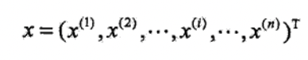

## 二 统计学习三要素

### 2.1 模型
所要学习的条件概率分布或决策函数。其中条件概率函数为概率模型，决策函数为非概率模型。

假设空间F是函数的无穷集合，F与函数的关系：
- 决策函数：F={f|Y=f(X)}
- 条件概率函数：F={P|P(Y|X)}

### 2.2 策略
在假设空间中选取最优模型。
损失函数：度量模型一次预测的好坏
风险函数：平均意义下模型预测的好坏

常用的损失函数包括0-1损失、平方损失、绝对损失、对数损失。损失函数越小，模型预测效果越好。
由于模型输入和输出是随机变量，遵循联合概率分布，所以损失函数的期望如下图，其中L(y, f(x))为损失函数。得到的期望即为风险函数（也称期望损失）
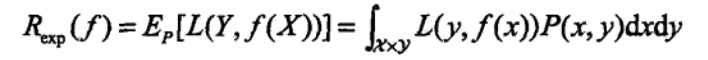
训练数据集的平均损失称为经验风险（也称经验损失）。
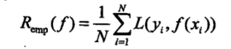

**期望风险(exp)是模型关于联合分布的期望损失；经验风险是(emp)是模型关于训练样本集的平均损失。根据大数定理，当N趋于无穷大的时候，emp=exp。但实际训练过程中，数据是有限的，用经验风险估计期望风险往往不理想**。所以要对经验风险进行矫正，涉及两个基本策略：经验风险最小化和结构风险最小化。

#### 2.2.1 经验风险最小化

假设空间、损失函数、训练数据集确定的情况下，经验风险可以确定。此时求出min经验风险，即可得到最优模型。
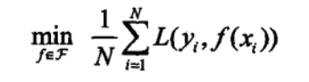
**结论：** 样本数量足够大的时候，可以得到很好的效果。当模型是条件概率分布，损失函数时对数损失的时候，经验风险最小化就等于**极大似然估计**。样本量不够时，会产生**过拟合**现象。

#### 2.2.2 结构风险最小化

结构风险最小化是为了防止过拟合而提出的。做法是在经验风险后面加一个正则项。
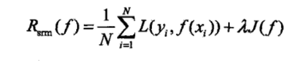
其中J(f)代表模型复杂度。模型f越简单，则J(f)就越小，也就是说复杂度代表对复杂模型的一个“惩罚”。**结构风险小需要经验风险和模型复杂度同时小**。结构风险小的模型往往对训练数据和未知的测试数据都有较好的预测。

**结论：** 结构风险最小的模型是最优模型，求最优模型等价于求下列表达式：
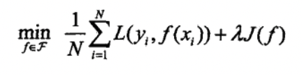

### 2.3 算法

算法指学习模型的具体方法。

## 三 模型评估与选择

### 3.1 训练误差与测试误差

训练误差是关于训练集的平均损失；测试误差是关于测试集的平均损失。训练误差往往判定一个问题是否容易学习；测试误差反映学习方法对未知数据的预测能力，通常称为泛化能力。**机器学习的目标就是使得测试误差尽可能的小**。

### 3.2 过拟合和模型选择

过拟合：对已知数据预测效果很好，对未知数据预测效果很差。导致的原因通常是学习时选择的模型包含的参数过多。
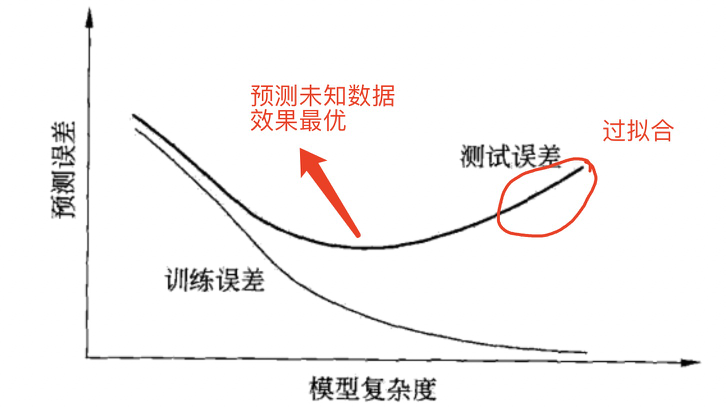

**解决方法：** 学习时，防止过拟合，就要选择复杂度合适的模型。常用的模型选择方法包括：正则化、交叉验证

## 四 正则化与交叉验证

### 4.1 正则化

正则化是结构风险最小化策略的实现。是在经验风险后加一个正则项（惩罚项）。模型越复杂，正则项值越大。
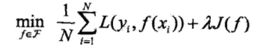
正则化项可以选择不同的形式。比如，在回归问题，损失函数的平方损失，则正则化项就可以是参数向量的L2范数
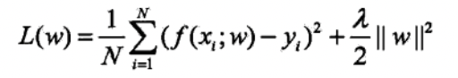
也可以是参数向量的L1范数
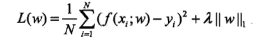

这里||w||代表二范数的意思，||w||1代表一范数的意思。
正则化的作用在于选择经验风险和模型复杂度同时小的模型。

### 4.2 交叉验证

在给定样本数据充足的情况下，将数据集分为三部分：训练集、验证集、测试集。测试集用来训练数据、验证集用来模型选择、测试集用来对最终学习结果进行评估。在学习到不同复杂度的模型中，**选择对验证集有最小预测误差的模型**。

很多时候，数据量并不是很多，可以使用**交叉验证**来“重复使用数据”。

1. 简单交叉验证
70%作为训练数据集、30%作为测试数据集。在不同参数个数条件下用训练数据去训练出不同的模型。在测试集上评价各个模型的误差。

2. S折交叉验证（应用最多）
随机的将数据集切分为S个互不相交的大小相同的子集。利用S-1个子集去训练，剩下一个子集数据用于测试模型。将这一过程的S种可能组合重复进行。最后选择S次评测中平均误差最小的模型。

## 五 泛化能力

### 5.1 泛化误差

泛化误差用来表示模型的泛化能力。事实上，泛化误差就是学习模型的期望风险。

### 5.2 泛化误差上界

TODO

## 六 生成模型和判别模型

监督学习可以分为生成方法和判别方法。所学习到的模型称为生成模型和判别模型。

生成模型：由数据学习到联合概率分布P(X,Y)，然后求条件概率分布P(Y|X)作为预测的模型：
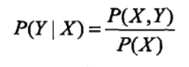

判别模型：由数据直接学习P(Y|X)或决策函数f(X)，直接面对预测。

**生成模型包括朴素贝叶斯、隐马尔科夫模型；判别模型包括k近邻、感知机、决策树、逻辑回归、最大熵模型、支持向量机、提升方法和条件随机场**

## 七 分类、标注、回归问题

分类：输出Y是离散数据
标注：例子：标记英文文章中的名词短语
回归：输出Y是连续的。按照输出变量的个数分为一元回归或多元回归，按照输入和输出变量之间的关系分为线性回归和非线性回归。