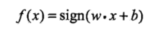
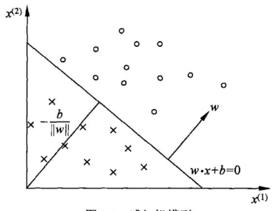
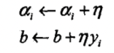
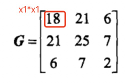

[toc]

# 感知机

感知机是神经网络和支持向量机的基础
## 一 感知机模型

感知机：输出为-1或1的函数，如下图所示，其中sign为符号函数。

感知机是线性分类模型，属于判别模型。感知机在超平面中有如下解释：
对于线性方程**w*x+b=0**来说，其对应于特征空间R^n中的一个超平面（在二维空间中，其为一条分割线）。超平面把特征空间分为两部分。两部分的点分别被分为正负两类。如下图所示：

## 二 感知机学习策略

线性可分：如果超平面S可以将训练集的数据完全正确的划分到超平面两侧，则称数据集线性可分。

&emsp;&emsp;对于感知机来说，损失函数的自然选择是所有误分类点的总数，但这样的函数不是关于w和b的连续可导函数，不易于求偏导进行后续优化。所以这里可以选择所有误分类点到超平面的总距离作为损失函数。在平面中，单个点(x0, y0)到直线Ax+By+C=0的距离为：d = $\frac{|Ax_{0}+By_{0}+C|}{\sqrt{A^2+B^2}}$。对于李航例子中的直线w*x+b=0来说，误分类点$A(x_{0}, y_{0})$到直线的距离为：$\frac{|wx_0+b|}{||w^2||}$，其中$||w^2||$是w的L2范数。
&emsp;&emsp;对于误分类点来说，$-y_{0}(wx_{0}+b)>0$成立。这是因为误分类点的预测结果$wx_{0}+b$和真实数据$y_0$相反。当$wx_{0}+b>0$时，$y_0=-1$，相反同理。所以误分类点到直线的距离也可以写成：$-\frac{1}{||w||}y_{i}(wx_0+b)$。假设误分类点的集合为M，**则所有误分类点到直线的距离总和为：** $-\frac{1}{||w||}\sum\limits_{xi\in{M}}y_{i}(wx_i+b)$，不考虑前缀项$\frac{1}{||w||}$，得到感知机的损失函数：L(w,b) = $-\sum\limits_{xi\in{M}}y_{i}(wx_i+b)$
&emsp;&emsp;很显然，L(w,b)是正值，如果分类点误差很大，则其值会很大，相反会很小。没有误分类点时，其为0。因为超平面函数本身是连续可导的，所以L(w,b)也关于w和b连续可导。故而**感知机的目标即是将损失函数最小化**

## 三 感知机学习方法

根据上节内容，可以知道感知机目标为$\min\limits_{w,b}L(w, b)$。这里采用随机梯度下降法（极小化过程中，不是将所有误分类点一起进行梯度下降，而是每次随机选取误分类点进行梯度下降，直到M集合中所有误分类点全部选完）。每次对w和b进行更新，这里容易得到L(w,b)对w和b的偏导数分别是：$x_iy_i$和$y_i$。设学习率为$\eta$，每次对w和b的更新公式如下：
$w = w + \eta y_i x_i$
$b = b + \eta y_i$

### 3.1 感知机算法的收敛性

这里只看结论，具体证明过程不深究（毕竟只是码农，不是数学家ε=(´ο｀*)))）：
**经过有限次搜索可以找到将训练数据完全正确的分离超平面**

可以容易想象到，感知机学习算法存在许多解（理论上可以画出无数分离超平面）。最终解（超平面）依赖于初始值的选择，也依赖于迭代过程中误分类点的选择顺序。如果想得到唯一的超平台，就需要对分离超平面增加约束条件，这在后续**线性支持向量机**中会讲到。
### 3.2 感知机算法的对偶形式

感知机算法的核心其实就是每次算出w和b的更新增量。w的总增量为$\sum\limits_{i=1}^{N}\alpha_ix_iy_i$，b的总增量为$\sum\limits_{i=1}^{N}\alpha_iyi$，这里$\alpha_i=n_i\eta$，所以可以看出越往后更新，$\alpha_i$越大，**因为更新次数越多，意味着它距离分离超平面的距离越近，也就越难分类，大的乘数因子也是为了更好区分**。如果初始值w=0、b=0，那么上述式子就是最后得到的w和b。那么最后得到感知机模型f(x)=$sign(\sum\limits_{i=1}^{N}\alpha_ix_iy_i x + b)$，这里问题也就转化到了每次更新$\alpha_i$和b上。那么如果遇到误分类点，则更新这两个参数：

在计算过程中，因为每次都有固定的$x_ix_j$，所以可以提前将训练集实例间的内积计算出来并以矩阵存储，称为**Gram矩阵**。
$Gram=[x_ix_j]_{N\times N}$

举个栗子：
一组数据中，正样本$x_1=(3,3)^T$，$x_2=(4,3)^T$，负样本$x_3=(1,1)^T$，那么Gram矩阵为对应向量求内积的结果：

