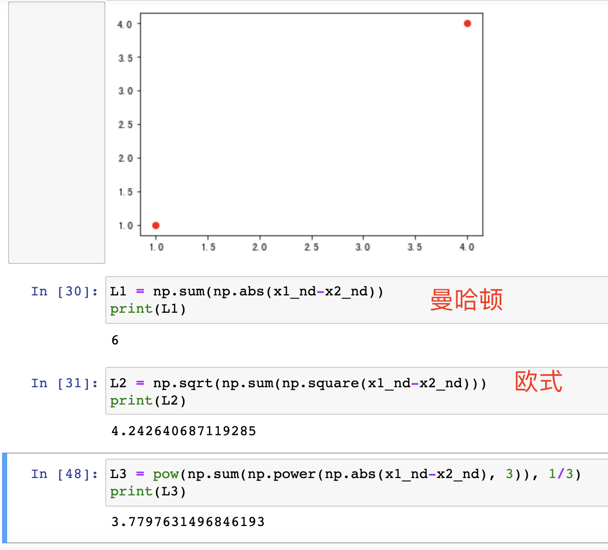

# K近邻法

## 一 距离度量

距离常用的有曼哈顿距离(p=1)和欧氏距离(p=2)，如下图：

## 二 k值选择

k值的选择如果过小，会导致整体模型复杂，出现过拟合；如果k值较大，就会导致近似误差变大，这时与输入实例较远的“不相关”点也会参与“决策”，导致出现误差

&emsp;&emsp;分类决策规则是多数表决，即由输入实例的最近k个近邻点决定，k个点中大多数的所属类即为输入点预测的结果。

## 三 KD树